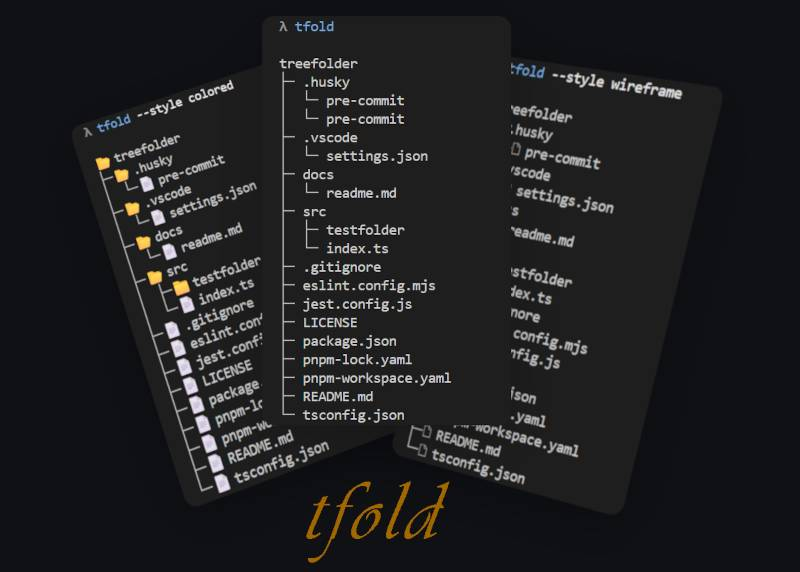

# Khatastroffik "Treefolder" aka "tfold"

A **node.js CLI utility** generating a **tree representation** (treeview) of a **folder structure** including its contained files and subfolders.

     



## Features

### Auto "root folder"

If not specified as a command line argument, the "root folder" of the tree is set to the current working directory aka `.`.

### Auto "ignore paths"

This tool is intentionally ignoring i.e. filtering out a few folder or file items by default and won't proceed with such ignored items i.e. those won't be visible in the resulting treeview.

The following paths (within the root folder) are ignored by default: `node_modules` , `dist`, `build`, `.git`, `.husky\_`, `logs`, `.angular` and `coverage`.

Notes:

- _Glob-syntax_ is not supported at the moment. The ignored paths are matching real folder paths, starting within i.e. resolved into the root folder.
- This filtering cannot be disabled or modified at the moment. Feel free to edit the ignored paths/items directly in the source code of the tool, when suitable.

### Sort leaves "folders first"

By default, the list i.e. the leaves of the treeview are sorted following the _"folders first" principle_: All the folders are listed first, then all the files. All items are alphabetically sorted. This apply at any depth within the tree structure.

This behavior can be _disabled_ using the command line argument `--unsorted`. In this case, all items are sorted the way the operating system does e.g. sorted by their names, regardless of their type (directory or file).

#### Verbose output

When the flag i.e. command line argument `--verbose` is defined/set, then a few more information will be displayed together with the tree representation.

### Styled output

The treeview i.e. tree representation can be generated and displayed using 4 different styles: **`none`** (default), **`black`**, **`wireframe`** or **`colored`**.
The style can be defined using the command line argument `--style`or `-s` like so: `--style <name of the style>`.

&rarr; Examples of styled output can be found in the additional documentation: [Styled output examples](docs/readme.md#styled-output-examples)

Note: some environments i.e. shells may not display the symbols (which are representedusing specific unicode code points like `U+1F5BF` or `U+1F5C1`) properly. Try to change the _font_ used in the shell in order to display the correct unicode symbols.

### Version information output

Use the command line argument `--version` or `-v` to display the version information about the tool.

## Installation

Note: this CLI tool requires `node.js` or a compatible JavaScript running environment to execute successfully. `npm`, `pnpm` or `yarn` may be required as well, in case you'd like to install the tool manually or to modify the source code.

### Manually install as a globally available CLI tool `tfold`

1. Clone (e.g. using `git`) or download this repository locally in order to make this tool available in your environment.

   ```ini
     gh repo clone khatastroffik/treefolder
     # or
     git clone khatastroffik/treefolder
   ```

1. Navigate to the repo folder:

   ```ini
   cd treefold
   ```

1. Install the (dev-) dependencies using your favorite package manager and transpile the TypeScript source code into a JavaScript module.

   ```ini
   # first install the development dependencies
   pnpm install
   # then transpile the source code to javascript
   pnpm build
   ```

1. Use your favorite package manager to install the tool globally. For example:

   ```ini
   npm install -g
   ```

   Note: _pnpm link_ seems to be broken, since it doesn't register the bin scripts after they have been properly linked.

1. Use the CLI tool alias `tfold`. E.g.:

   ```ini
   # in any directory/folder simply run
   tfold
   # you may use additional arguments too, in order to configure the output
   tfold --verbose -s colored /c/DEV/a-folder-to-be-scanned
   # or
   tfold c:\\DEV\\another-folder --unsorted --style wireframe
   ```

## Usage

### &rarr; **Run the tool directly (after installation)**

See [Installation](#installation) above

### &rarr; **Run the typescript code directly** (development)

```ini
pnpm tsx src\index.ts
# or
pnpm tsx src\index.ts ..\..\some-folder
# or
pnpm tsx src\index.ts --style=colored --unsorted --verbose c:\test\some-other-folder
# ...
```

or

### &rarr; **Build and run the javascript code** (development)

```ini
# at least once
pnpm build
# then
pnpm start
# or
node .
# or
node . ..\..\some-folder
# or
node dist\index.js ..\..\some-folder
# or
node dist\index.js --style=colored --unsorted --verbose c:\test\some-other-folder

```

or

### &rarr; **Run and watch for code changes** (development)

```ini
pnpm dev
```

---

<style>pre {line-height:1.0em !important;}</style>

```text
┌─────────────────────────────────────────────┐
|                                             |
   ╭━┳━╭━╭━╮╮
   ┃┈┈┈┣▄╋▄┫
   ┃┈┃┈╰━╰━━━━━━╮            "K11K"
   ╰┳╯┈┈┈┈┈┈┈┈ ◢█◣    a very pragmatic dog
    ┃┈┈┈┈┈┈┈┈┈┈████
    ┃┈┈┈┈┈┈┈┈┈┈◥█◤
    ┃┈┈┈┈╭━┳━━━━╯
    ┣━━━━━━┫
|                                             |
└──────────── made by khatastroffik ──────────┘
```
